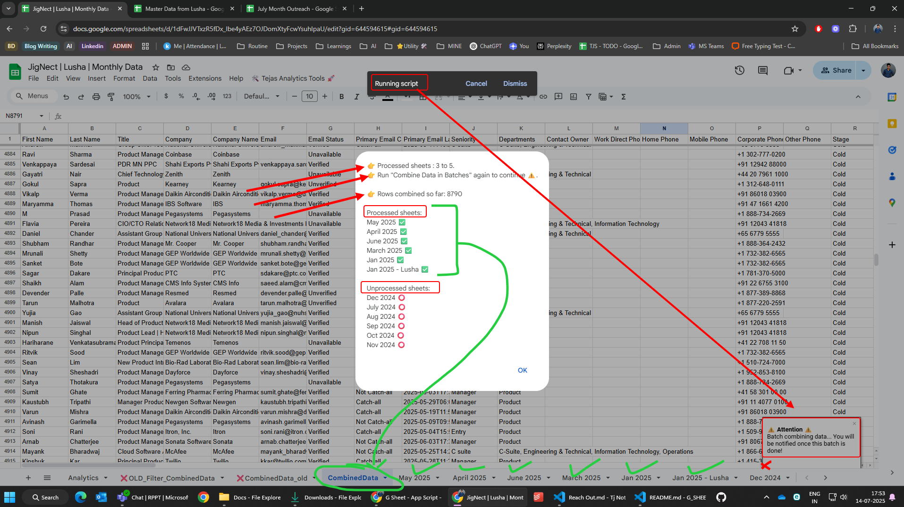
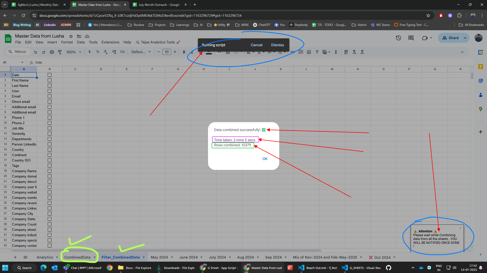

### 24july25_0346pm

#### `Tejas_ICP_LeadsData_CleanUp_Tools.js`  
- This has whole big list of cleanup functions to be applied any scrapped data pasted with `Ganja Smoked 🌿`
    - 

#### `normalizeCompanySizeIntervals_7.js`  
- 🧠 This function cleans and standardizes company size data by mapping numeric values from either `# Employees` (preferred if non-empty) or `Size of Company` columns into defined size intervals such as `0-10`, `11-50`, etc.

  - It extracts the first number from each source cell (ignoring commas and plus).  
  - Matches this number to configured intervals.  
  - Writes the normalized label into a configurable output column.  
  - If the output column doesn’t exist, it creates it right after 'Size of Company' (or '# Employees' if 'Size of Company' is missing).  
  - If output column is the same as 'Size of Company', it overwrites in place.  
  - Skips empty or invalid values by labeling them as 'NA'.  
  - Safe to rerun multiple times; doesn’t alter unchanged cells unnecessarily.  
  - Displays progress with toast and final UI alert.  

  - **Configuration options**:  
      - `sourceColumns`: Object defining the input columns ('# Employees' and 'Size of Company').  
      - `outputColumn`: Name of the column for normalized labels.  
      - `sizeIntervals`: Array of interval ranges (e.g., ['0-10', '11-50', '51-200']).  
      - `overwrite`: Boolean to allow overwriting 'Size of Company' if set as output.

------------------------------------

### 23july25_846pm
- `CleanupAndSortLeadsSheetsData.js`
    - This has lot of good and roubust versions of cleaning functions - IN PROGRESS

- `generateMissingCountry_5.js`
    - This function generates a report of missing 'Company Country' in the 'Lead_CleanedData' sheet.
    - It checks for missing country based on the presence of 'Company City' and 'Company State'.
    - It creates a new sheet named 'MissingCountry' or clears it if it already exists.
    - It populates the sheet with rows where 'Company Country' is missing.
    - Rows with both city and state missing are ignored.
    - Rows where state exists but city is missing can be excluded via configuration.
    - Includes rows where city is present but state is missing, or both city and state are present.
    - Configuration options:
       - `targetSheetName`: Name of the source sheet to check for missing country.
       - `outputSheetName`: Name of the output sheet where results will be written.
       - `columns`: Object defining the column names for city, state, and country.
       - `excludeStateMissingCity`: Boolean to exclude rows where state is present but city is missing.

- `autoFillMissingByKeyMap_4.js`
    - Generates a detailed report of missing details in the 'Lead_CleanedData' sheet.
    - It checks pairs or triplets of columns for missing data and conflicts.
    - The report is generated in a new or cleared sheet named 'MissingDetails'.
    - Handles both pairs (e.g., City and Country) and triplets (e.g., State, City, and Country).
    - It can also detect conflicts where multiple values exist for a single key.a
    -     - Configuration is done at the top of the script for easy modification.
    -         - like which columns to check, and whether to include pairs or triplets.
    -         - like `targetSheetName` for defining the source sheet name.
    -         - like `columnSets` for defining which columns to check.
    -         - like `missingSheetName` for defining the output sheet name.

### 16july25_846pm
- `autoFillMissingByKeyMap_3.js`
    - It uses a mapping of existing key-value pairs to fill in missing values.
    - The target sheet, key column, and value column are configurable.
    - It highlights the filled cells with a specified color.
    - It provides user feedback through toasts and alerts.    
- `cleanAndAggregateLeads_2.js`
    - It collects data from all valid sheets, excluding those with "❌" in their name or specified in an exclusion list.
    - It normalizes the data according to a predefined set of headers.
    - region mapping is applied based on company country.
    - The output is placed in a new sheet named "Lead_CleanedData".
- `generateSheetColumnMatrix_1.js`
    - The output is placed in a new sheet named "All_Sheet_Columns".
    - The script collects all unique headers from the sheets and aligns the data accordingly.
    - It skips empty sheets and those with names containing "CombinedData" or "Old".
    - The first column of the output contains the sheet names.
    - from 2nd row onwards, it lists the headers of each sheet.

### 15july25_840pm
- `merge_2_columns_into_one.js` ✅
    - If "Title" is empty, it takes the value from "Job title".
    - If both columns have values, it highlights those rows in light red.
    - If there are no conflicts, it deletes the "Job title" column after merging.

### 14july25_943pm
- `5_combile_mulitple_sheets_data_with_batch_processing_progress.js` ✅✅
    - This script provides 4 separate utility functions for Google Sheets
        - **Freeze First Row in All Sheets**
            - The function iterates through all sheets and sets the first row as frozen.
        - **Combine Data in Batches (Exclude ❌ and Specified Sheets)**
            - The script collects all unique headers from the sheets and aligns the data accordingly.
            - The combined data is placed in a new sheet named `CombinedData`.
            - The script processes sheets in batches (default batch size is 3) to avoid timeouts.
            - It maintains a progress state using script properties to handle large datasets without losing progress.
            - shows alert after each batch is processed, indicating how many sheets were processed and how many remain.
            - It skips completely empty rows and fills in missing columns with blanks.
        - **Auto-Fill Company Country**
            - If a city has a corresponding country, it fills in the country for rows where it is missing.
            - It highlights the filled 'Company Country' cells with a light red background.
        - **Create Filter_CombinedData Sheet**
            - The headers are copied from the "CombinedData" sheet and placed vertically.
            - Each header has a corresponding checkbox for filtering purposes.
        - **Show Batch Combine Progress**
            - Displays an alert showing processed and unprocessed sheets.
            - This helps users track the progress of the batch combining operation.
            - shows processed sheets with a "✅" and unprocessed sheets with a "⭕".
            - If the "CombinedData" sheet is missing, it resets all progress properties and considers all sheets as unprocessed.

    - Look How it will Look in this shot
        - 

- `4_combile_mulitple_sheets_data_with_batch_processing.js` ✅
    - All is same as `4_combile_mulitple_sheets_data_with_batch_processing`.
    - only *Batches processed Progress* is missing
- `3_combine_multiple_sheets_data_with_diff_headers_into_one.js` ❌
    - All is same as `4_combile_mulitple_sheets_data_with_batch_processing`, but it processes all the sheets at once instead of batchwise processing, that's the only difference.
    - 

- `2_combine_multiple_sheets_data_with_diff_headers_into_one.js` ❌
    - All is same as `3_combine_multiple_sheets_data_with_diff_headers_into_one`, but below features are part of combining process and it creates overload on script exeuction and limit reached issue.
        - Auto-fill Company Country based on Company City mapping
        - Create Filter_CombinedData sheet with vertical headers and checkboxes
- 

### 7july25_554pm
- `combine_multiple_sheets_data_with_diff_headers_into_one.js`
    - Combines data from all sheets (excluding ❌ and specified sheets) into a single `CombinedData` sheet, aligning different headers automatically.
    - Adds a custom menu for easy access.
    - Data Processing Time will be displayed once all sheet data combined into one.

- `freeze.js`
    - Adds a menu to freeze the first row in all sheets with one click.
    - Useful for keeping headers visible during scrolling.

- `notifications.js`
    - Adds a menu with options to show various toasts and alerts in Google Sheets.
    - Toasts
        - Simple Toast
        - Toast with Title
        - Toast with Custom Duration
        - Toast Until Clicked
    - Alert
        - OK Alert
        - OK/Cancel Alert
        - Yes/No Alert
        - Yes/No/Cancel Alert
        - Yes/No/Cancel Alert
        - Alert with Title

### 4june25_1206pm
- `auto_id_generate_regenerate_on_any_change.js` ✅

    - **Description**: 
        - Auto-updates IDs in Column A for sheet name ending with word `-Expenses` after any change   (edit, row insert, row delete, paste). Includes an `Expense Tools` menu for manual ID regeneration wheenver you want.

    - **Features**:
      - Generates unique IDs in Column A based on non-empty Column B entries.
      - ID format: `[XX]-[number]` (e.g., `AD-1` for `Admin-Expenses` sheet).
      - Updates IDs dynamically on any spreadsheet change via `onChange` trigger.
      - Supports manual ID regeneration through the "Expense Tools" menu.
      - Syncs IDs with non-empty rows in Column B.

    - **Setup**:
      1. Open the script editor in Google Sheets (`Extensions > Apps Script`).
      2. Paste the script content.
      3. Add a trigger:
         - Click the clock icon (Triggers).
         - Select `+ Add Trigger`.
         - Choose Choose which function to run - `onChange`
         - Choose which deployment should run - `Head`
         - Select event source - `From spreadsheet`
         - Select event type - `On change`
         - Click on `Save` to save trigger.
      4. Save the script and refresh the sheet to access the "Expense Tools" menu.

    - **Notes**:
      - Assumes the first row is a header; processes data from row 2.
      - Works only on sheets ending with "-Expenses".
      - Shows an alert if manual regeneration is attempted on a non-compatible sheet.

---

- `auto_id_generate_regenerate_on_edit_and_add_row.js` ⭕
    - Auto-generates unique IDs in Column A based on entries in Column B for sheets ending with `-Expenses`.
    - IDs use the format [XX]-[number], where XX is the sheet prefix (e.g., AD-1).
    - Adds a custom `Expense Tools` menu on top in G-sheet to manually regenerate all IDs.
    - Efficiently updates all IDs at once and ensures IDs stay in sync with non-empty rows in Column B.
    - ID will be generated and modified automatically in below case
        - editing column B ( i.e ususally a Expense date) - very normal case 😆
        - adding a row in between, then you add date in that row so it will be auto generated and changed also for adjacent row id's.
        - `NOT WORKS IF any row or rows get deleted in Bulk, Adjacent Ids will not be updated 😑`

---

- `auto_generate_id_on_edit.js` - ⁉️ have some issues 
    - Auto-generates unique IDs in Column A when a value is entered in Column B, for sheet name ending with `-Expenses`.
    - ID format: [XX]-[number], where XX is the sheet prefix (e.g., AD-1).
    - IDs update dynamically and clear if Column B is empty.

### 15may25_846am
- `pre_post_hotfix_release_email_merged.js`
    - Adds 6 different buttons for drafting and sending emails for `pre`, `post` and `hotfix` release communication over email.
    - Subject will have timestamp
    - subject will support emojis
    - Confuguration Options
        - users who can see custom menu button.
        - subject for each email.
        - pretable content for each email.
        - posttable content is same now for all email, but can be configured.
        - whether to send visible columns only or hidden columns as well.
        
### 2may25_925pm
- `wrapText_in_edited_cell.js`
    - Automatically enables "Wrap Text" formatting for any cell that is edited and not left empty, ensuring all content is visible.
    - On opening the sheet, sets the active cell to 10 rows below the last filled cell in column C (if any), for quick navigation.
    - Checks for duplicate Bug IDs in column A (when a cell in column A is edited):
        - If a duplicate is found, shows an alert, highlights the cell, and marks it as "Duplicate".
    - Designed for sheets where column A tracks unique Bug IDs and column C is actively updated.
### 1may25_925pm
- `sendTableEmail_final_1may25_738pm.js`
    - This script adds a custom menu to a Google Spreadsheet that allows authorized users to send an email containing a formatted HTML table of data from the active sheet. 
    - The email includes options for CC and BCC, and it can be configured to send only visible columns or all columns from the sheet.

## Git Things 🌿

```bash
# Original URL
https://github.com/tejaspatel-jt/tj-google-sheets-magic

# Change origin with specific git account.
git remote set-url origin https://tejaspatel-jt@github.com/tejaspatel-jt/tj-google-sheets-magic.git

# Update last Push + select branch as nothing after origin, NO master NO main 😆 (WIDELY USED )
git add . && git commit --amend --no-edit && git push --force origin

# update last push and last commit msg too ✅
git add . && git commit --amend -m "<MODIFIED COMMMIT MSG>" && git push --force origin

# Make Local Repo to Match with Remote Repo (No Extra Commits) - If working on same repo from 2 machines.
git fetch origin && git reset --hard origin/main
```

# ***********************************************************
# References for making this type of Readme.md file Online
1. [Preview MD file online](https://markdownlivepreview.com/)

2. [Convert Normal Table to MD formatted table](https://www.tablesgenerator.com/markdown_tables) by Copy Paste Table / CSV data

### Others
3. [Code to Image Converter](https://10015.io/tools/code-to-image-converter)

